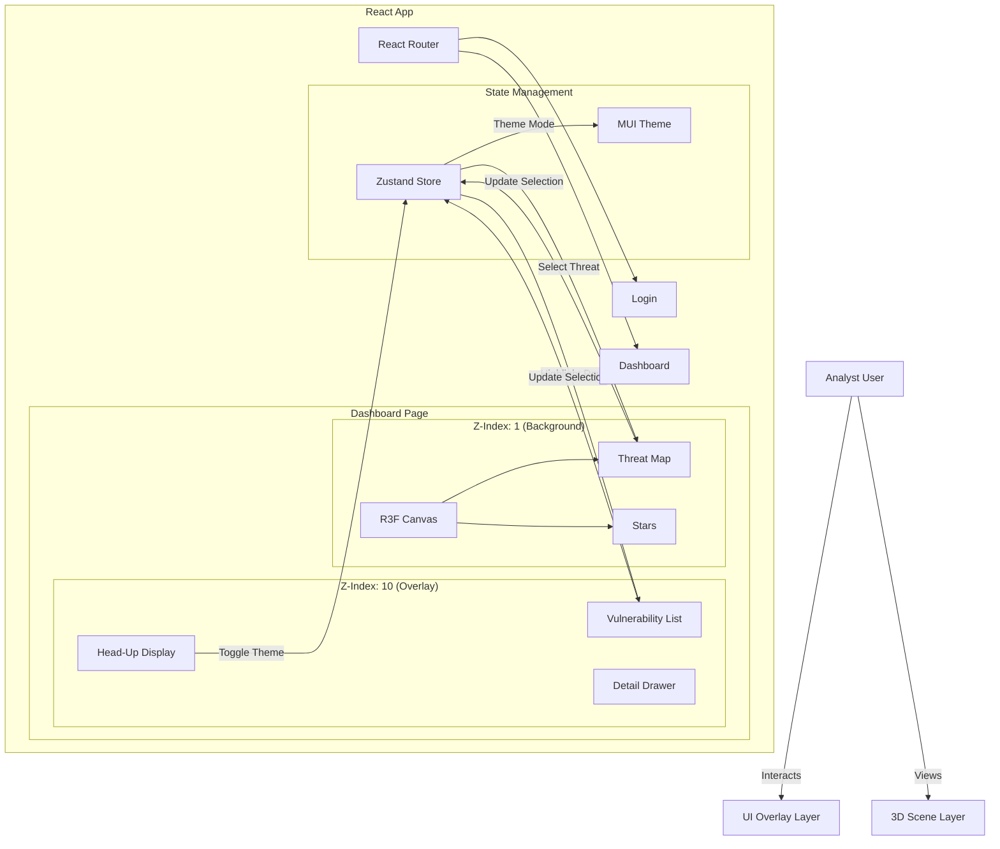

# DefSec 3D Dashboard

**A Next-Generation Security Operations Center (SOC) Interface.**


DefSec 3D transforms traditional flat vulnerability lists into an immersive **Spatial Interface**. By combining a high-performance 2D data grid with a 3D orbital threat map, it allows security analysts to visualize the global distribution of threats, identify critical assets instantly, and manage vulnerabilities with unprecedented context.

---

## 🏗 Architecture

The project implements a **Hybrid 2D/3D Architecture**, separating the heavy visualization layer from the interactive UI layer while keeping them synchronized via a global state.



### 🧠 Diagram Explanation

The architecture diagram above illustrates the **Unidirectional Data Flow** and **Layered Rendering** strategy used in this application:

1.  **Dual-Layer Rendering**:
    *   **The User** sees a composite view. The **UI Overlay Layer** (Z-Index 10) handles traditional interactions (buttons, forms, lists) using Material UI.
    *   The **3D Scene Layer** (Z-Index 1) runs in the background using `react-three-fiber`. It renders the immersive Global Threat Map.
    *   **Interaction Tunneling**: We use CSS `pointer-events: none` on the UI container to allow clicks to pass through empty spaces (like between HUD elements) down to the 3D canvas, while keeping buttons clickable (`pointer-events: auto`).

2.  **State Synchronization (The "Glue")**:
    *   **Zustand Store** serves as the single source of truth. It is not just a data cache, but a messaging bus between the 2D and 3D worlds.
    *   **Flow Example**:
        1.  User clicks a row in **Vulnerability List** (2D).
        2.  `List` component dispatches `setSelectedThreat(id)` to the **Store**.
        3.  The **Store** updates its state.
        4.  The **Threat Map** (3D), which subscribes to the store, automatically detects the change and highlights the corresponding node on the globe.
    *   This decouples the visualizers from each other; the List doesn't know about the Globe, and the Globe doesn't know about the List. They only know about the Store.

### Core Components
1.  **Scene Layer (Background):** A `React-Three-Fiber` canvas that renders the 3D world (Stars, Lights, Threat Globe). It sits at `z-index: 1`.
2.  **UI Layer (Overlay):** A Material UI (MUI) interface using absolute positioning to float above the 3D scene. Interaction clicks pass through empty UI areas to the 3D map.
3.  **State Management (Glue):** `Zustand` acts as the bridge. Hovering a row in the 2D table updates the store, which triggers the 3D node to highlight, and vice versa.

### File Structure
```
src/
├── components/
│   ├── canvas/       # 3D Components (R3F)
│   │   ├── Scene.tsx      # Canvas Setup & Lighting
│   │   └── ThreatMap.tsx  # The Interactive Globe
│   ├── ui/           # 2D HUD & Controls (MUI)
│   │   ├── HUD.tsx        # Top Bar (Stats, Theme Toggle)
│   │   └── VulnerabilityList.tsx # Interactive Data Grid
│   └── visuals/      # Shared Design Assets
├── pages/            # Page Layouts
│   ├── Dashboard.tsx # Main orchestration logic
│   └── Login.tsx     # Authentication entry
├── store.ts          # Global State (Zustand)
└── theme.ts          # MUI Theme / Design Tokens
```

---

## 🛠 Tech Stack

-   **Core Framework:** React 19 (Vite)
-   **3D Engine:** React Three Fiber (Three.js) & Drei (Helpers)
-   **UI Library:** Material UI (MUI) v7
-   **State Management:** Zustand (w/ Persist Middleware)
-   **Language:** TypeScript
-   **Routing:** React Router v7

---

## ✨ Key Features

### 1. Immersive Visualization
-   **3D Threat Map:** Geographic representation of vulnerabilities.
-   **Interactive Nodes:** Hover/Click on the globe to drill down into specific CVEs.
-   **Cyberpunk Aesthetic:** "Glassmorphism" UI design with neon accents and blurs.

### 2. Advanced Data Operations
-   **Priority Mode:** Single-click filter for "The Perfect Storm" (Critical Severity + Internet Facing + Exploit Available).
-   **Smart Filtering:** "Analysis" and "AI Analysis" modes to filter out noise (invalid/norisk statuses).
-   **SLA Tracking:** Visual cues for overdue items.
-   **Search:** Instant client-side search across ID and Descriptions.

### 3. Enterprise Foundations
-   **Authentication:** Protected Routes (`RequireAuth`) with Login/Logout flow.
-   **Dynamic Theming:** Instant switching between "Cyberpunk Dark" (Night Shift) and "Corporate Light" (Day Shift) modes.
-   **Persistence:** User preferences (Theme) and Session state are saved locally.

---

## 🚀 Future Plans & Roadmap

### Phase 1: Real-Time Data (Next)
-   [ ] **WebSocket Integration:** Replace `demo_data.ts` with live socket feeds.
-   [ ] **Server-Side Pagination:** Optimize `VulnerabilityList` for 100k+ records.

### Phase 2: AI Integration
-   [ ] **LLM Assistant:** "Ask the Dashboard" feature (e.g., "Show me all Log4j variants").
-   [ ] **Auto-Remediation:** AI-generated patch suggestions in the details panel.

### Phase 3: Spatial Computing
-   [ ] **XR Support:** WebXR Integration for VR/AR headset review of the threat landscape.

---

## 📦 Setup & Run

1.  **Clone & Install**
    ```bash
    git clone repo_url
    cd security-dashboard-3d
    npm install
    ```

2.  **Start Development Server**
    ```bash
    npm run dev
    ```

3.  **Access**
    -   Open `http://localhost:5173`
    -   **Login:** `test@test.com` / `password`

### Dataset
Currently using a static sample in `src/data/demo_data.ts` to keep the repo light. The `dataTransformer` utility handles the flattening and 3D coordinate generation.

---

*Built with ❤️ by Priynka Sudhakar Reddy.*
